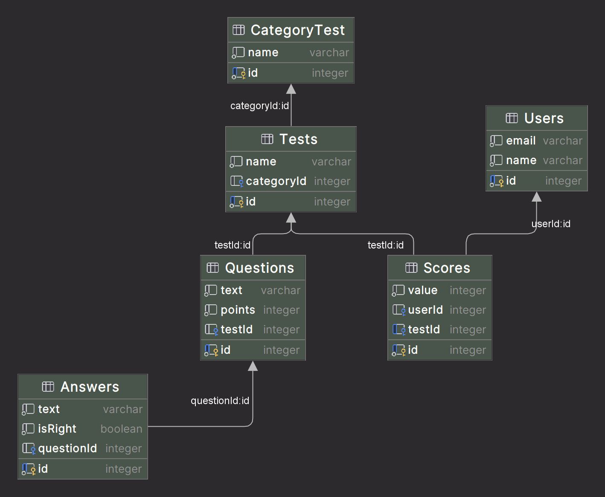

Шевцова Олеся Евгеньевна М33031 
Название: quizzical 
Тесты на различные темы 
https://quizzical-7lbe.onrender.com/

<h2>Описание сущностей БД</h2>
<h3>User</h3>

Пользователь

<ul> 
    <li>id (pk, int) - идентификатор</li>
    <li>email (varchar) - почта пользователя</li>
    <li>name (varchar) - имя пользователя</li>
</ul>

<h3>Test</h3>

Тест

<ul> 
    <li>id (pk, int) - идентификатор</li>
    <li>name (varchar) - название теста</li>
    <li>categoryId (fk, int) - идентификатор категории тестов</li>
</ul>

<h3>Score</h3>

Счёт пользователя

<ul> 
    <li>id (pk, int) - идентификатор</li>
    <li>value (int) - значение скора</li>
    <li>userId (fk, int) - идентификатор пользователя, получившего этот скор</li>
    <li>testId (fk, int) - идентификатор теста для этого счета</li>
</ul>

<h3>Question</h3>

Вопрос в тесте

<ul> 
    <li>id (pk, int) - идентификатор</li>
    <li>text (varchar) - текст вопроса</li>
    <li>points (fk, int) - количество очков за этот вопрос, если ответить правильно, прибавится к скору пользователя</li>
    <li>testId (fk, int) - идентификатор теста к которому относится этот вопрос</li>
</ul>

<h3>AnswerOption</h3>

Вариант ответа на вопрос

<ul> 
    <li>id (pk, int) - идентификатор</li>
    <li>text (varchar) - текст ответа</li>
    <li>isRight (boolean) - правильным или неправильным является ответ</li>
    <li>questionId (fk, int) - идентификатор вопроса к которому относится этот вариант ответа</li>
</ul>

<h3>CategoryTest</h3>

Вопрос в тесте

<ul> 
    <li>id (pk, int) - идентификатор</li>
    <li>name (varchar) - название категории</li>
</ul>

<h2>Диаграмма</h2>
